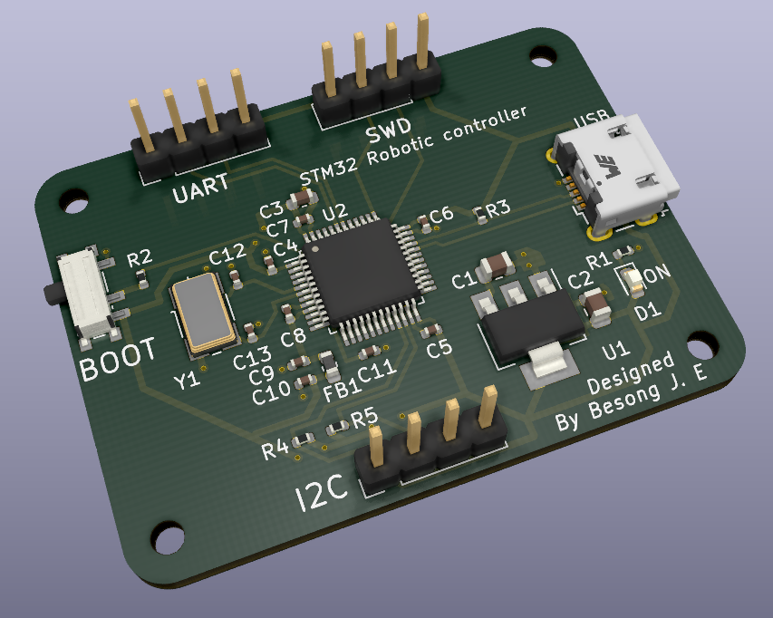
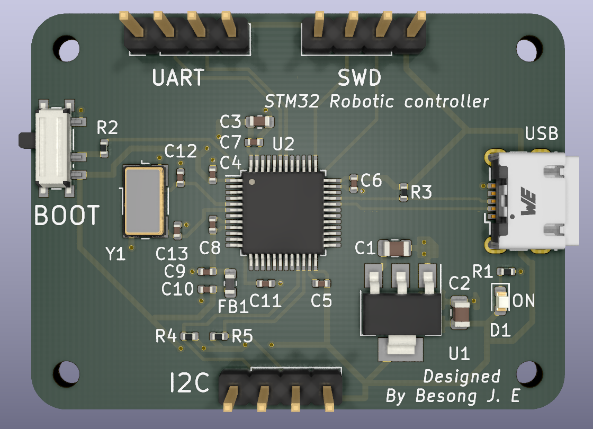

# STM32 Robotic Controller Hardware
This project introduces a simple design of a PCB board layout for robotics applications. The microcontroller used in the board design is the STM32F103C8T6. The STM32F103C8T6 is a medium density performance line ARM Cortex-M3 32bit microcontroller in the 48 pin LQFP package. It incorporates high performance RISC core with up to 72MHz operating frequency, high speed embedded memories, extensive range of enhanced I/Os and peripherals connected buses.

The designed board can be used as an alternative to the well known and documented Arduino and raspberry pie hardware. Also, the provided design can be modify to add more memory if needed. This however increases the complexity of the hardware.

## Isometric view
The USB type use is the microUSB. This can be change to USB type-C which is becoming the de facto standard nowadays.

 ## Top view
 There is provision for I2C and UART connector in the design. This means that the I2C and the UART bus lines can both be used.

 

## The PCB layout
The PCB layout was done using the KICAD EDA version 5.61 and the design is opensource with the design files provided for download in the folder "docs" above. Advanced version of the KICAD EDA can also be used to open the design files.

